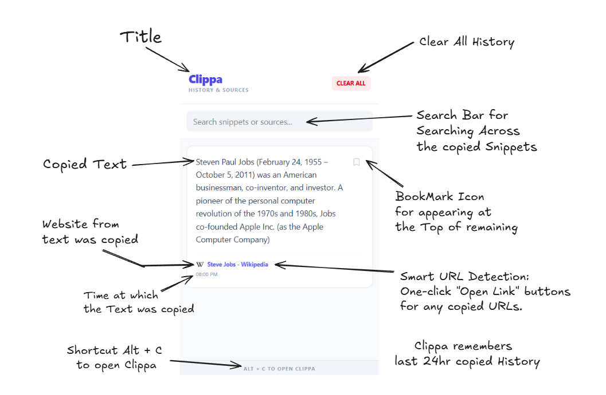

#  Clippa:

For my own use i created **Clippa** taking inspiration from android clipboard.
**Clippa** is a modern, privacy-first clipboard manager for Chrome/Brave. It doesn't just save what you copy/cut; it remembers where you found it. Built with **React**, **Tailwind CSS v4**, and **TypeScript**. Help of Gemini is also taken while creating this. I am open-sourcing it so that everybody can use.

---

##  Demo Preview



---


##  Features:

-  **24-Hour Smart History**: Automatically cleans up old snippets to keep your list fresh.
-  **Pinning**: Keep important information forever by pinning it to the top.
-  **Source Tracking**: Every clip includes the website title and favicon from where it was copied.
-  **Smart URL Detection**: One-click "Open Link" buttons for any copied URLs.
-  **Instant Search**: Search through your history and website sources instantly.
-  **Tailwind v4 UI**: A clean, app-like interface that follows modern design standards.
-  **Keyboard Shortcut**: Toggle the manager using `Alt + C`.

---

##  Installation (Developer Mode):

Follow these steps to install Clippa locally for development:

1. **Clone the Repo:**
   ```bash
   git clone https://github.com/farhanxansari/clippa.git
   cd clippa

2. **Install Dependencies:**
    ```bash
    npm install

3. **Build the Project:**
    ```bash
   npm run build

4. **Load into Chrome/brave:**

    -  **Open your browser and go to chrome://extensions.**:
    -  **Turn on Developer mode (toggle in the top right).**:
    -  **Click Load unpacked and select the dist folder in your project directory.**:
   
---

### Core Components:

- **`src/content.ts`** – The "Ear"  
  Injected into webpages to listen for `copy` and `cut` events. Captures text along with website metadata (title, favicon, URL).

- **`src/background.ts`** – The "Brain"  
  Service worker that manages `chrome.storage` and handles the 24-hour automatic cleanup logic for unpinned clips.

- **`src/App.tsx`** – The "Face"  
  The main React interface featuring:
  - **Pinning** – Keep important clips forever by pinning them to the top
  - **Source Tracking** – Every clip includes the website title and favicon
  - **Smart URL Detection** – One-click "Open Link" buttons for copied URLs
  - **Instant Search** – Search through your history and website sources in real-time
  - **Tailwind v4 UI** – Clean, modern interface following design standards

- **`public/manifest.json`** – The "Blueprint"  
  Defines extension permissions, icons, background script configurations, and:
  - **Keyboard Shortcut** – Toggle the manager using `Alt + C`

---

##  Privacy:

**Your data stays with you.**

- **Local Storage Only**: All clipboard history is stored locally using `chrome.storage.local`
- **No Data Transmission**: No data is ever sent to external servers
- **Zero Tracking**: No analytics, tracking, or telemetry included
- **Offline Operation**: The extension works entirely offline within your browser
- **Auto-Cleanup**: Unpinned clips are automatically removed after 24 hours (configurable)

Your clipboard data never leaves your computer. The extension only requests the minimum necessary permissions to function.

---

##  How to Use:

### Basic Usage
1. **Copy or Cut** – Highlight any text on a webpage and press `Ctrl+C` (Copy) or `Ctrl+X` (Cut)
2. **Open Manager** – Press `Alt+C` or click the extension icon to view your clipboard history
3. **Browse & Search** – Scroll through your history or use the search bar to find specific clips

### Advanced Features
- **Pin Important Clips** – Click the 📌 icon on any clip to save it permanently (bypasses 24-hour cleanup)
- **Visit Original Sources** – Click the website favicon or title at the bottom of a clip to jump back to the original page
- **Smart URL Detection** – Copied URLs show an "Open Link" button for instant navigation
- **Quick Actions** – Hover over clips for copy/delete/pin options

###  Pro Tips
- Use the search bar to filter by website name or content
- Pin frequently used snippets (addresses, emails, code) for quick access
- The history automatically organizes with newest clips at the top

 **Important Note**  
After installing or updating the extension, you must **refresh any open browser tabs** for Clippa to start capturing copy events from those pages.
